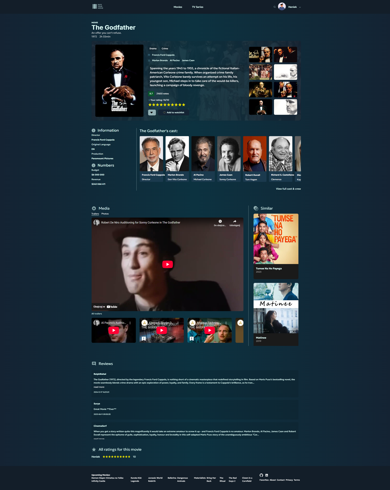
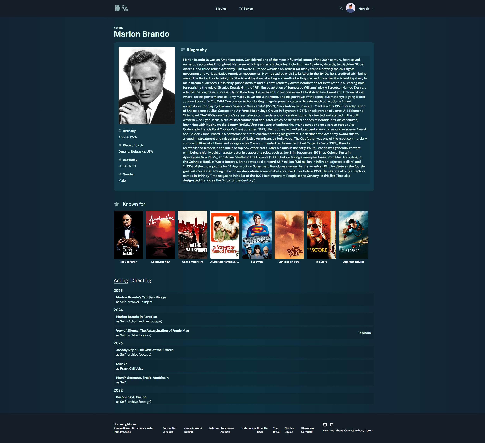

# 🎬 Movie App for Browsing and Rating Movies & TV Series

Projekt to nowoczesna aplikacja webowa inspirowana serwisem Filmweb, stworzona z wykorzystaniem React, która umożliwia:

- przeglądanie filmów i seriali,
- ocenianie obejrzanych tytułów,
- zapisywanie ich w swojej bibliotece (do obejrzenia, ulubione),
- sprawdzanie szczegółowych informacji o aktorach oraz twórcach.

Dane są pobierane z [TheMovieDB API](https://www.themoviedb.org/)

---

## 🔧 Technologie

- React (z routingiem)
- Context API
- CSS
- Fetch API + async/await
- TheMovieDB API
- JWT
- Express
- MongoDB

---

## 📸 Przykładowe screeny

### 🔍 Strona filmu

Zawiera szczegółowe informacje o filmie, średnią ocenę użytkowników, możliwość oceny własnej, dodania do ulubionych lub listy do obejrzenia:

---

### 👤 Strona aktora

Pokazuje dane osobowe, znane role, ostatnie role pogrupowane wg lat:

---